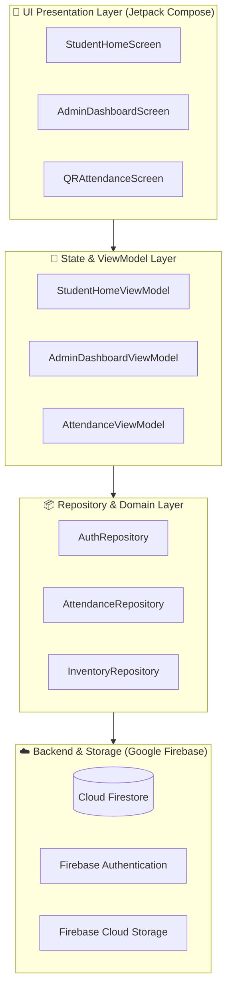

<div align="center">


### ✧ *Enterprise-Grade Cyber-Robotics Lab Management & Research Ecosystem* ✧

[](https://github.com/Ankitsatnami/RW_HUB_apk/actions)
[](https://kotlinlang.org)
[](https://developer.android.com)
[](https://opensource.org/licenses/MIT)

<br/>

**[ 📥 Download APK (Direct) ](https://ankitsatnami.github.io/RW_HUB_apk/RW_HUB.apk) ❖ [ 🌐 Live Web Simulator ](https://ankitsatnami.github.io/RW_HUB_apk/) ❖ [ 📖 User Guide ](USER_GUIDE.md) ❖ [ 🐛 Report Bug ](https://github.com/Ankitsatnami/RW_HUB_apk/issues/new?template=bug_report.yml)**

<br/>

</div>

---

> [!NOTE]  
> **Robotics Wala Hub (RW HUB)** is a comprehensive, production-ready Android mobile application and web-based management platform built specifically for university robotics laboratories, makerspaces, innovation centers, and hardware research clubs.

<br/>

## ❖ ❲ 📑 Table of Contents ❳

<details>
<summary><b>Click to Expand</b></summary>

- [Overview](#-overview)
- [Key Features](#-key-features)
- [System Architecture](#-system-architecture)
- [Tech Stack](#-tech-stack)
- [Project Directory Structure](#-project-directory-structure)
- [Getting Started & Build Instructions](#-getting-started--build-instructions)
- [Web Simulator](#-web-simulator)
- [Contributing & License](#-contributing)
</details>

<br/>

## ❖ ❲ ⚡ Key Features ❳

<table>
  <tr>
    <td width="50%">
      <h3>🔐 <kbd>Authentication & Role Isolation</kbd></h3>
      <ul>
        <li>Secure Firebase Authentication (Email & Password).</li>
        <li>Approval-gated student onboarding (Pending, Approved, Suspended).</li>
        <li>Dedicated dashboards tailored for <code>Students</code> vs. <code>Admins</code>.</li>
      </ul>
    </td>
    <td width="50%">
      <h3>📷 <kbd>Digital QR Attendance Engine</kbd></h3>
      <ul>
        <li>Lightning-fast QR scanning via <b>Google ML Kit + CameraX</b>.</li>
        <li>Dynamic attendance QR generation using <b>ZXing</b> for faculty.</li>
        <li>Automated lab work hours calculation and duplicate prevention.</li>
      </ul>
    </td>
  </tr>
  <tr>
    <td width="50%">
      <h3>🗓️ <kbd>Lab Slot & Bench Scheduling</kbd></h3>
      <ul>
        <li>Interactive workstation and equipment booking calendar.</li>
        <li>Automated conflict detection prevents overlapping reservations.</li>
        <li>Admin one-click approval, rescheduling, and cancellation alerts.</li>
      </ul>
    </td>
    <td width="50%">
      <h3>⚙️ <kbd>Hardware & Tool Inventory</kbd></h3>
      <ul>
        <li>Catalog for microcontrollers (ESP32, STM32, Arduino), sensors, actuators.</li>
        <li>Atomic checkout & return system with real-time stock deductions.</li>
        <li>Low-stock triggers and overdue equipment tracking.</li>
      </ul>
    </td>
  </tr>
  <tr>
    <td width="50%">
      <h3>🏆 <kbd>Continuous Achievement Showcase</kbd></h3>
      <ul>
        <li>Dynamic sliding image showcase on student dashboard.</li>
        <li>Admin photo upload pipeline with instant live broadcast.</li>
        <li>Digital certificate portfolio with gamification points & badges.</li>
      </ul>
    </td>
    <td width="50%">
      <h3>🚀 <kbd>Projects, Tasks & Budget Tracker</kbd></h3>
      <ul>
        <li>Multi-student team milestones with progress tracking.</li>
        <li>Weekly milestone submission and faculty review workflow.</li>
        <li>Bill & expense receipt upload with automated balance auditing.</li>
      </ul>
    </td>
  </tr>
</table>

<br/>

## ❖ ❲ 🏛️ System Architecture ❳

> [!TIP]
> RW HUB strictly adheres to the modern Android **MVVM (Model-View-ViewModel)** architectural pattern with Google's recommended **Clean Architecture** principles.



<br/>

## ❖ ❲ 🛠️ Tech Stack ❳

### 💠 Android Application


### ☁️ Backend & Cloud Services


<br/>

## ❖ ❲ 💻 Getting Started & Build Instructions ❳

> [!IMPORTANT]
> - **Android Studio** Ladybug (2024.2.1+) or newer is required.
> - Ensure **JDK 17** or **JDK 21** is configured in your `JAVA_HOME`.

```bash
# 1. Clone the repository
git clone https://github.com/Ankitsatnami/RW_HUB_apk.git

# 2. Navigate into project directory
cd RW_HUB_apk

# 3. Assemble Debug APK
./gradlew assembleDebug
```

> [!WARNING]
> Before running the app, make sure to add your own `google-services.json` from Firebase Console to the `app/` directory!

<br/>

## ❖ ❲ 🌐 Web Simulator ❳

Can't install the APK right now? RW HUB includes a high-fidelity, interactive **Web Simulator** that runs in any modern browser!

**[ 🚀 Launch Simulator Online ](https://ankitsatnami.github.io/RW_HUB_apk/)**

*Or run locally:*
```bash
npx serve .
```

<br/>

## ❖ ❲ 🤝 Contributing & License ❳

<div align="center">

Contributions are what make the open-source community an amazing place to learn, inspire, and create. Any contributions you make are **greatly appreciated**!

Distributed under the **MIT License**. See [`LICENSE`](LICENSE) for more details.

---

**Lead Maintainer:** [@Ankitsatnami](https://github.com/Ankitsatnami) ✦ **Project:** Robotics Wala Hub (RW HUB) 🤖


</div>
