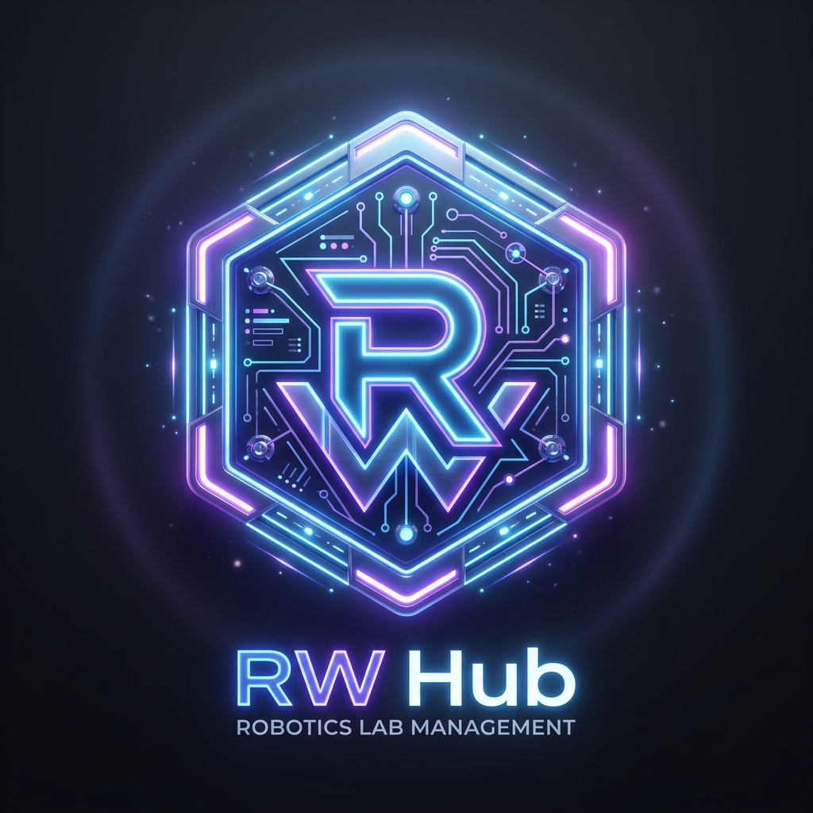
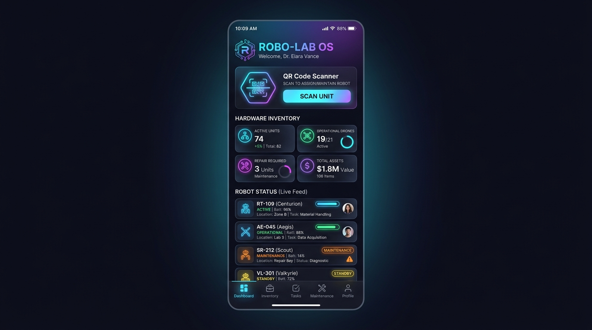
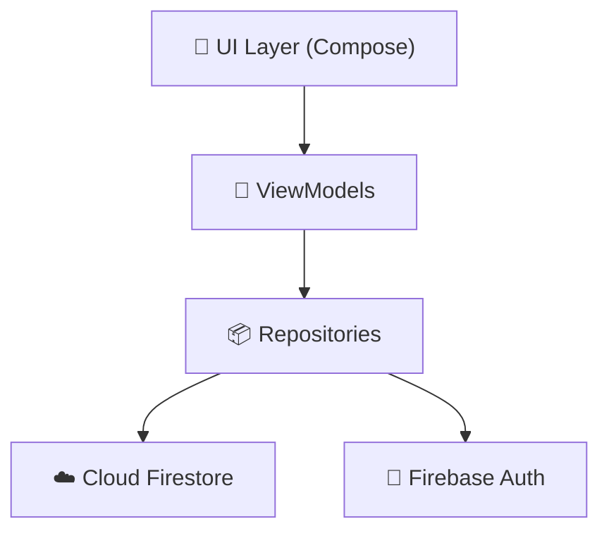

#  ROBOTICS WALA HUB (RW HUB)

**Enterprise-Grade Cyber-Robotics Lab Management & Research Ecosystem**

 

 
 

 

## ✨  Next-Gen Interface

> Experience the future of laboratory management with our highly polished, dark-mode specialized interface designed exclusively for robotics researchers.

  

 

## 🛠️  Modern Tech Stack

   
  
   
   

---

## ⚡  Core Features

<table>
  <tr>
    <td width="50%">
      <h3>🔐 <code>Secure Access</code></h3>
      
Role-isolated dashboards for Students vs Admins. Approval-gated onboarding powered by Firebase Auth.

    </td>
    <td width="50%">
      <h3>📷 <code>QR Smart Scanning</code></h3>
      
Lightning-fast hardware checkout and attendance tracking via Google ML Kit + CameraX.

    </td>
  </tr>
  <tr>
    <td width="50%">
      <h3>🗓️ <code>Lab Slot Allocation</code></h3>
      
Interactive workbench reservation system with automated conflict detection & alerts.

    </td>
    <td width="50%">
      <h3>⚙️ <code>Hardware Inventory</code></h3>
      
Real-time atomic tracking for ESP32s, sensors, and actuators. Never lose a component again.

    </td>
  </tr>
</table>

 

## 🌐  Zero-Install Web Simulator

> [!TIP]  
> Can't install the APK right now? We've built an incredible, high-fidelity Web Simulator that runs directly in your browser.

**👉 [Launch Interactive Simulator](https://ankitsatnami.github.io/RW_HUB_apk/)**

 

## 🏛️  Architecture

 

  

**Built with ❤️ for robotics clubs, student engineers, and future innovators.**

